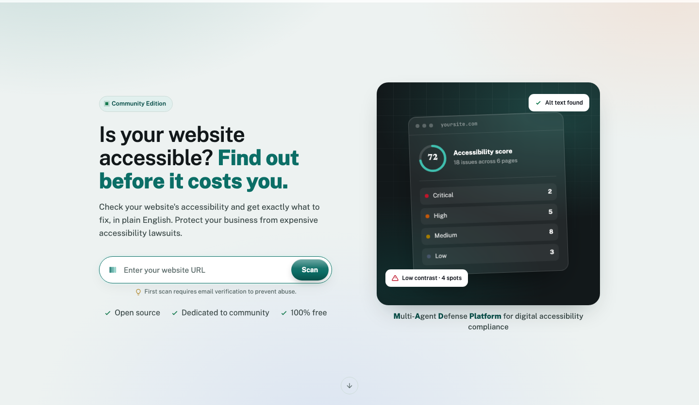
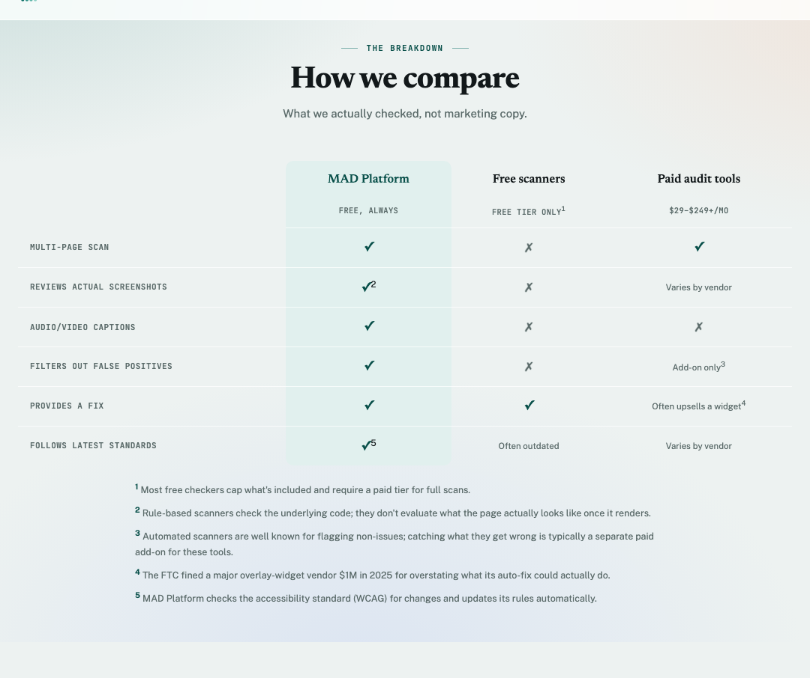

# MAD Platform — Community Edition

[](https://github.com/pandayv/mad-platform-community/stargazers)
[](https://github.com/pandayv/mad-platform-community/forks)
[](LICENSE)

Is your website accessible? Most business owners find out the hard way,
when a demand letter arrives instead of a warning. A proper audit costs
money and takes weeks most owners don't have; free scanners bury the
real problems under false positives and leave you guessing what to fix
first.

**MAD Platform finds and explains accessibility problems in plain
language**, checks its own work before showing you anything, and hands
you a recommended fix for each one, so you find out before it costs you.
Free. No account.



The homepage also lays out how the free tool stacks up against other
scanners, backed by what's actually checked:



Built solo for the [All Things Agentic Hackathon](https://allthingsagentichackathon.devpost.com/)
on Gemini, Google's Agent Development Kit (ADK), and Google Cloud. This
is the ongoing community fork: same free public tool, an architecture
that's moved on since the submission (scanning now runs on its own
queue/worker service instead of in the request handler), and a README
that describes what's actually deployed today, not what shipped that
weekend.

---

## Try it

**[mad-platform.org](https://mad-platform.org)** — paste in a URL, give
an email address for the report, watch it scan.

### What to expect

1. Submit any real URL on the website above.
2. Watch the status page track live progress. A multi-page scan usually
   takes one to three minutes. If there's a burst of traffic ahead of
   you, you'll see a queued state first — scans process one at a time per
   worker instance, and the page tells you it's safe to close the tab.
3. On the completed report, every confirmed finding is listed with a
   suggested fix and a status. Anything flagged "Awaiting internal
   review" is a low-confidence or critical finding a human hasn't
   confirmed yet.
4. The report and a CSV of confirmed findings (in Jira's importer column
   format, so it drops straight into a real ticket tracker if you have
   one) get emailed to the address the scan was submitted with.

## What it does

- **Picks its own targets.** Reads the site's own nav and decides which
  pages carry real risk — home, contact, forms — rather than crawling
  everything.
- **Checks each page three ways.** Deterministic rules for what has a
  right answer (contrast, missing alt text, heading structure, form
  labels, ARIA misuse, tab order); an AI visual pass for what a
  screenshot reveals that markup doesn't; and an AI semantic review
  grounded in the actual WCAG standard text, retrieved fresh rather than
  recalled from memory.
- **Verifies before it trusts itself.** Every flag gets independently
  re-checked against the evidence. A false positive is dismissed with a
  documented reason; a real finding gets a confidence score.
- **Ranks by what actually matters** — WCAG conformance level, how often
  that violation type shows up in real litigation, estimated user
  impact — not raw technical severity.
- **Writes the report.** One styled HTML page: overall score, severity
  breakdown, a plain-English summary, a concrete fix per finding.
- **Acts on it.** Exports every confirmed finding as a CSV in Jira's
  importer format and emails the full report — no ticket-tracker account
  needed to use either.
- **Survives getting interrupted.** A crash or a redeploy mid-scan
  resumes from the last completed checkpoint, not from zero.
- **Keeps its own reference current**, checking on a schedule whether
  the WCAG standard itself has changed.

## What a scan looks like

Watch it work, with live phase labels and a per-page checklist:


When it's done, you get a score, a severity breakdown, and a ranked list
of findings with suggested fixes:


## Tech stack

- **AI:** Gemini via Vertex AI for every call, real-time or batch
  (`gemini-3.5-flash-lite` for high-volume calls, `gemini-3.7-flash` for
  judgment calls, `gemini-embedding-001` for retrieval)
- **Agent framework:** Google Agent Development Kit (ADK)
- **Compute:** Cloud Run, three scale-to-zero services split by trigger
  type and resource profile —
  - `scan-onboarding`: the public web app. Thin and cheap (1Gi memory,
    concurrency 20, no browser automation), since it only ever enqueues
    work, never runs it.
  - `scan-worker`: not publicly reachable, only Cloud Tasks' dedicated
    invoker identity can call it. Runs the actual pipeline (Playwright,
    Gemini, one scan at a time per instance — 2Gi memory,
    `containerConcurrency=1`).
  - `scan-wcag-poller`: not publicly reachable either, ticked daily by
    Cloud Scheduler to check for WCAG standard updates.

  plus one lightweight Cloud Run Job (`pattern-miner`) for a weekly
  pattern-mining task.
- **Queueing:** Cloud Tasks (`scan-queue`) sits between `scan-onboarding`
  and `scan-worker` — submitting a scan enqueues a task rather than
  running the pipeline in the request handler, so a burst of traffic
  queues instead of falling over, and a scan that dies mid-run gets
  retried without the visitor having to resubmit anything.
- **State:** Firestore, for job checkpoints, findings, escalation queue,
  WCAG knowledge-base embeddings, confirmed learned patterns, and
  anti-abuse quota counters (with a TTL policy on the short-lived ones)
- **Storage:** Cloud Storage, for generated reports
- **Scheduling:** Cloud Scheduler, driving the WCAG freshness check
  (daily) and the pattern miner (weekly)
- **Browser automation:** Playwright, for headless rendering, screenshots,
  and computed-style extraction for real contrast-ratio checking — this
  is the one dependency that lives only in `scan-worker`'s image
- **Web:** FastAPI, powering the scan-submission UI, status API, and
  website's FAQ/legal pages
- **Anti-abuse:** Cloudflare Turnstile (opt-in, off unless a site key is
  configured) plus disposable-email filtering and per-email/per-IP/global
  monthly quota
- **Ticketing:** CSV export by default, in Jira's importer column format,
  so confirmed findings drop straight into a real tracker with no account
  needed; a real Jira integration also exists in code as an opt-in for
  anyone self-hosting this with their own Jira Cloud instance
- **Notifications:** Email via Resend, sending the full report to the
  address a scan was submitted with; Slack (an incoming-webhook alert on
  escalation, a summary on completion) exists in code as an opt-in,
  neither is required
- **Security:** the crawler refuses to fetch private/internal network
  addresses; an access-code gate (Secret Manager) on the internal review
  queue exists and fails closed if unconfigured, for anyone who wants to
  run a private instance instead of a public one

## Setting this up yourself

**Mandatory:** a GCP project with billing enabled, the `gcloud` CLI, and
Python 3.13+. **Optional:** Resend (email delivery), Cloudflare Turnstile
(bot mitigation), and a review code, Jira, or Slack if you want a
private instance instead of a public one — skip all three and you still
get a fully working public tool.

Two ways to run it. Either way, this is
[AGPL-3.0](#license) — a modified version run as a hosted service still
has to make its source available to the people using it.

**1. Fast path.** [Fork this repo](https://github.com/pandayv/mad-platform-community/fork)
to stay connected to upstream, clone it, then:

```bash
export PROJECT_ID=YOUR_PROJECT_ID
./setup.sh
```

One idempotent script, safe to re-run after a partial failure. Ends with
a working public instance at your own Cloud Run URL. Jump to
[Running the tests](#running-the-tests) once it's done.

**2. Full DIY path.** Every step by hand, with the reasoning behind
each one: [SETUP.md](SETUP.md). Useful if you want to understand what's
being created before you create it, or run a private instance instead
of a public one.

## Running the tests

```bash
pip install -r requirements-dev.txt
python -m pytest
```

No GCP credentials, no Firestore emulator, and no network access are
needed — that's deliberate. Every module in this codebase constructs its
GCP clients lazily (see `mad_platform/config.py` and the accessor
functions in `mad_platform/state/`, `mad_platform/tools/`), so importing
and testing the pure logic, the LLM-output validation boundary, and the
routes that don't need a live backend costs nothing and needs nothing.

## Project structure

```
mad_platform/
  agents/        # Orchestrator, Analyst, Editor, Reporter, Action Agent,
                  # WCAG auto-heal, Pattern Miner (persistent memory),
                  # LLM-output index validation (shared trust boundary)
  tools/         # Crawler, rule checks, AI checks, ADK client, RAG,
                  # WCAG version fetch, issue sink, Slack/email notify,
                  # anti-abuse pre-filters, SSRF-safe URL guard, retry
                  # classification, untrusted-content delimiting
  state/         # Firestore + Cloud Storage clients (lazy singletons)
  web/           # scan-onboarding's app (submission UI, status page,
                  # internal review queue, open feedback form),
                  # scan-worker's app (the pipeline's push target),
                  # scan-wcag-poller's app, shared theme/charts
  data/          # Curated WCAG success-criteria corpus
  severity.py    # The severity vocabulary, defined once (a real Literal
                  # type, not five independently-drifting string lists)
  config.py      # The one place required environment configuration is
                  # read -- no defaults for anything naming a cloud
                  # resource, values read lazily so import stays
                  # side-effect-free
docs/            # Self-hosted architecture diagram (GitHub Pages)
tests/           # pytest suite -- pure logic, LLM-boundary validation,
                  # and routes that don't need live GCP (see above)
setup.sh                       # One-command deploy -- automates the numbered steps above
run_scan.py                    # CLI entry point for a one-time scan
review_escalations.py          # Internal review queue CLI (web UI is the primary surface)
check_wcag_version.py          # Manual trigger for the WCAG freshness check
mine_patterns.py               # Manual trigger for the pattern miner
Dockerfile                     # scan-onboarding -- no Playwright, thin and cheap
Dockerfile.worker               # scan-worker -- the one image with Playwright/Chromium
Dockerfile.wcag_poller / Dockerfile.pattern_miner
cloudbuild.worker.yaml / cloudbuild.wcag_poller.yaml / cloudbuild.pattern_miner.yaml
```

## Support this project

If this was helpful, support the project:
[contribute](https://github.com/pandayv/mad-platform-community) on
GitHub, [leave feedback](https://mad-platform.org/feedback), share it, or
[buy me a coffee](https://buymeacoffee.com/madplatform).

## License

[GNU Affero General Public License v3.0](LICENSE) (AGPL-3.0).

AGPL, not MIT or Apache-2.0, because this is a network service: AGPL is
the license that carries the obligation across that boundary, so a
modified version run as a hosted service still has to make its source
available to the people using it, not just to whoever it's handed to as
a binary.

## About the creator

Solo build by Vipul Panday, drawing on a background in Product,
Technology, Risk, and Compliance.
