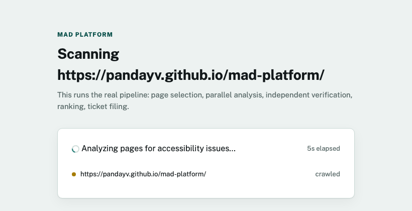
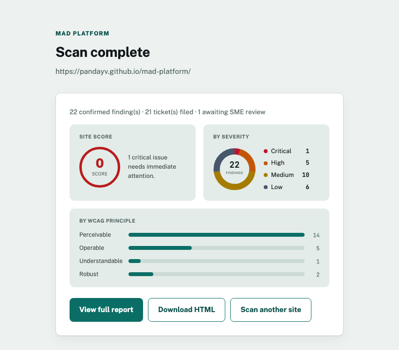

# MAD Platform

**Multi-Agent Defense Platform, for accessibility compliance.** An
autonomous agent that scans a website for accessibility problems,
verifies its own findings, and takes real action on what's confirmed, not
just a report.

Built for the [All Things Agentic Hackathon](https://allthingsagentichackathon.devpost.com/)
on Gemini, Google's Agent Development Kit (ADK), and Google Cloud.

---

## Try it live

**[Live scanner](https://scan-onboarding-803013053073.us-central1.run.app):**
paste in a URL and watch it scan. Access is gated by a code (a
deliberate security measure, see *Tech stack* below).

**[Internal review queue](https://scan-onboarding-803013053073.us-central1.run.app/review):**
where the low-confidence or critical findings the pipeline can't fully
autonomize land for a human to confirm or dismiss. Gated by a separate
code from the scan form above, intentionally not customer-facing.

**[Guardian Pest Control](https://pandayv.github.io/mad-platform/):** a
small fictional business site, seeded with real accessibility violations,
built to give the scanner a consistent, reliable target ([`docs/`](docs/)).

**[Architecture diagram](https://pandayv.github.io/mad-platform/architecture.html):**
the full pipeline, the WCAG auto-heal loop, and the Google Cloud
infrastructure behind it.

### Testing it yourself

Here's the fast path to seeing it work end to end. Access codes for the
scanner and review queue are provided in the Devpost submission, not
here.

1. Open the live scanner above, enter the access code, and submit a
   URL. The demo site works well, or try any real one.
2. Watch the status page track live progress. A multi-page scan usually
   takes one to three minutes, depending on how many pages get selected
   and real-time model latency.
3. On the completed report, every confirmed finding shows a
   "Filed: [ticket key]" badge, a real Jira ticket created live by that
   scan, no Jira account needed to see it.
4. Anything marked "Awaiting internal review" can be resolved at the
   review queue above. Confirming or dismissing it updates the report's
   badge in real time.

Slack alerts post to a private workspace channel and can't be opened by
an outside tester; see the demo video for that part.

## The problem

Website-accessibility lawsuits (ADA-related, in the US) are a real and
growing risk for small businesses, most of whom have no practical way to
know they're exposed. Manual accessibility audits are expensive and slow.
Automated scanners exist, but they're noisy (full of false positives a
non-technical business owner can't triage), and a report alone doesn't fix
anything; someone still has to turn it into work that gets done.

MAD Platform removes that blind spot: point it at a URL, and it finds real
issues, checks its own work before trusting it, explains what matters most
in plain language, and files the confirmed ones as tickets automatically,
while routing the genuinely uncertain ones to a human instead of guessing.

## Guiding principles

Four principles shaped every design choice in this build, each backed by
what's actually running, not just stated intent.

### Trust, but verify
- Editor independently re-checks every Analyst finding against actual
  evidence before it's trusted, not just re-summarized.
- WCAG citations are grounded in retrieved standard text (RAG), not a
  model's unverified recollection.
- Every page gets three parallel checks: rule-based, semantic, and
  multimodal visual check, reasoning over the actual rendered screenshot.

### Fit for purpose
- Three-tier model selection: `flash-lite` for high-volume calls, `flash`
  for judgment calls worth the cost, and a self-hosted Gemma for a
  background job mining dismissal patterns.
- Orchestration pattern chosen per step: sequential where order matters,
  parallel where it doesn't, dynamic delegation reserved for genuine
  judgment calls.
- Deterministic checks stay plain code, not LLM calls, because they don't
  need judgment; every real-time model call runs through Google ADK's
  `LlmAgent` and `Runner`, not a raw SDK call; every prompt is bounded to
  what that call actually needs, not the full page dumped in.

### Autonomy with accountability
- Every irreversible action is idempotent, human-gated, or both; if a
  scan is resumed after interruption, it resumes past what is already
  completed.
- Least privilege applies at every layer: every part of the system can
  only touch what its job requires, and the customer-facing tool and the
  internal review tool don't share access at all.
- The crawler refuses to fetch private, internal, or cloud-metadata
  addresses to protect from threats.
- Two layers of audit trail: Google Cloud's own Audit Logs for
  infrastructure action, and the pipeline's own record.

### Self-improving
- A self-hosted Gemma model mines Editor's real dismissal history for
  recurring, consistent patterns; confirmed ones become permanent
  grounding for every scan that follows, not a one-time fix.
- The WCAG knowledge base heals itself the same way: a scheduled check
  keeps it current, refreshing automatically for minor changes and
  asking a person first for anything structural.

## What it does

1. **Scans a site autonomously.** Decides which pages matter most on its
   own (home, contact, forms), then checks them with both deterministic
   rule checks (contrast, missing alt text, heading structure, form
   labels, ARIA misuse, tab order) and AI-assisted review for what rules
   can't judge, like whether alt text is actually descriptive.
2. **Verifies its own findings.** Every flag is independently
   double-checked before it's trusted; false positives get dismissed with
   a documented reason, real findings get a confidence score.
3. **Ranks by real-world risk**, not raw technical severity: WCAG
   conformance level, how often that violation type shows up in real
   accessibility litigation, and estimated user impact.
4. **Produces an actionable report:** a styled, self-contained HTML
   report with an overall score, severity breakdown, plain-English
   executive summary, and a concrete suggested fix per finding.
5. **Takes real action.** Files a ticket automatically for every
   confirmed finding; routes the low-confidence or critical minority to a
   human reviewer instead, who can confirm or dismiss.
6. **Recovers from failure.** A scan interrupted mid-way (crash, redeploy)
   resumes from its last completed checkpoint rather than starting over or
   silently duplicating work.
7. **Keeps its own reference material current.** Periodically checks
   whether the WCAG standard itself has changed, auto-refreshing for minor
   additive updates and routing structural changes to human review before
   acting on them.

## Try it yourself: what a scan looks like

Paste a URL into the web app, and watch it work:



When it's done, you get a score, a severity breakdown, and the full report:



## Tech stack

- **AI:** Gemini via Vertex AI (`gemini-3.5-flash-lite` for high-volume
  calls, `gemini-3.7-flash` for judgment calls) for every real-time,
  user-facing call; a self-hosted Gemma (`gemma3:4b` via Ollama, its own
  Cloud Run Job) for the one background batch job (dismissal-pattern
  mining) that has no live-latency pressure
- **Agent framework:** Google Agent Development Kit (ADK)
- **Compute:** Cloud Run, two scale-to-zero services (`scan-onboarding`,
  `scan-wcag-poller`) split by trigger type and resource profile, plus
  one Cloud Run Job (`pattern-miner`) for the Gemma batch miner
- **State:** Firestore, for job checkpoints, findings, escalation queue,
  WCAG knowledge-base embeddings, and confirmed learned patterns
- **Storage:** Cloud Storage, for generated reports
- **Scheduling:** Cloud Scheduler, driving the WCAG freshness check
  (daily) and the dismissal-pattern miner (weekly)
- **Browser automation:** Playwright, for headless rendering, screenshots,
  and computed-style extraction for real contrast-ratio checking
- **Web:** FastAPI, powering the scan-submission UI and status API
- **Ticketing:** Jira REST API, behind an abstraction (`IssueSink`) so a
  second tracker could be added without touching Orchestrator or Reporter
- **Notifications:** Slack, via an incoming webhook: a real-time alert
  when a finding or a WCAG version change is escalated to a human, a
  summary posted when a scan completes
- **Security:** the public scan endpoint requires an access code (Secret
  Manager) and the crawler refuses to fetch private/internal network
  addresses

## Setting this up yourself

### What you need

- A Google Cloud project with billing enabled.
- The `gcloud` CLI, installed and authenticated (`gcloud auth login`).
- Python 3.10+ locally (the ADK toolchain needs it).
- Optional, for real ticket filing and notifications: a free Jira Cloud
  account and a Slack workspace. Without these, the pipeline runs against
  a mock ticket sink and skips notifications, everything else works.

**IMPORTANT:** Replace `YOUR_PROJECT_ID` below with your actual GCP project
ID, the only value you need to choose here.

`GOOGLE_CLOUD_PROJECT` and `GCS_BUCKET_NAME` aren't separate inputs, they're
derived from it automatically on the next two lines, but they're just as
required: the app's Firestore and Storage clients read them directly and
each falls back to a hardcoded project/bucket if unset, so skipping these
lines means every write silently targets the wrong place instead of failing
loudly, including when testing locally in step 5, not just once deployed.

```bash
export PROJECT_ID=YOUR_PROJECT_ID
export GOOGLE_CLOUD_PROJECT="$PROJECT_ID"
export GCS_BUCKET_NAME="${PROJECT_ID}-reports"
gcloud config set project "$PROJECT_ID"
```

### 1. Clone and set up the local environment

```bash
git clone https://github.com/pandayv/mad-platform.git
cd mad-platform
python3 -m venv .venv && source .venv/bin/activate
pip install -r requirements.txt
playwright install --with-deps chromium
```

### 2. Enable the APIs this project actually uses

```bash
gcloud services enable \
  run.googleapis.com firestore.googleapis.com secretmanager.googleapis.com \
  storage.googleapis.com aiplatform.googleapis.com cloudscheduler.googleapis.com \
  cloudbuild.googleapis.com
```

### 3. Create Firestore and a Cloud Storage bucket

```bash
gcloud firestore databases create --database=scan-firestore \
  --location=us-central1 --type=firestore-native
gcloud storage buckets create "gs://${PROJECT_ID}-reports" --location=us-central1
```

The Firestore database name is non-default (`scan-firestore`) on purpose,
so every `firestore.Client(...)` call in this codebase passes
`database="scan-firestore"` explicitly. Easy to forget if you're used to
the client library's default; connects to an empty database if missed.

### 4. Authenticate locally and confirm Vertex AI works

```bash
gcloud auth application-default login
```

Model availability varies by project; confirm what's actually there
before assuming a model name works:

```bash
python -c "from google import genai; c = genai.Client(vertexai=True, project='$PROJECT_ID', location='global'); [print(m.name) for m in c.models.list()]"
```

The client location must be `global`, not a region like `us-central1`;
some models list in a region's catalog but 404 when actually called
there. This is independent of which region Cloud Run itself deploys to.

### 5. Test the pipeline locally, before deploying anything

```bash
python run_scan.py https://example.com
```

This exercises the real pipeline end to end against your real GCP
project (Vertex AI, Firestore) with a mock ticket sink, no Cloud Run
deployment needed yet. Confirms steps 2-4 actually worked before you
spend time deploying.

### 6. Create an Artifact Registry repo for the container images

```bash
gcloud artifacts repositories create mad-platform \
  --repository-format=docker --location=us-central1

PROJECT_NUMBER=$(gcloud projects describe "$PROJECT_ID" --format='value(projectNumber)')
gcloud projects add-iam-policy-binding "$PROJECT_ID" \
  --member="serviceAccount:${PROJECT_NUMBER}-compute@developer.gserviceaccount.com" \
  --role="roles/artifactregistry.writer"
```

### 7. Deploy `scan-onboarding` (the public app)

**IMPORTANT:** Replace `YOUR_ACCESS_CODE` and `YOUR_REVIEW_CODE` below with
your own values, or the ones from the Devpost submission to reproduce the
exact demo a judge is testing.

```bash
gcloud iam service-accounts create scan-onboarding-sa
SA_ONBOARDING="scan-onboarding-sa@${PROJECT_ID}.iam.gserviceaccount.com"

gcloud projects add-iam-policy-binding "$PROJECT_ID" \
  --member="serviceAccount:${SA_ONBOARDING}" --role="roles/datastore.user"
gcloud projects add-iam-policy-binding "$PROJECT_ID" \
  --member="serviceAccount:${SA_ONBOARDING}" --role="roles/aiplatform.user"
gcloud storage buckets add-iam-policy-binding "gs://${PROJECT_ID}-reports" \
  --member="serviceAccount:${SA_ONBOARDING}" --role="roles/storage.objectAdmin"

# The one thing standing between the public --allow-unauthenticated
# endpoint and someone using it as a free Gemini-calling, Playwright-
# fetching open relay. printf, not `openssl rand -hex 12`, which stores
# a trailing newline the app's comparison never strips, so the code it
# generates could never actually be typed back in correctly.
printf '%s' "YOUR_ACCESS_CODE" | gcloud secrets create mad-ui-access-code --data-file=-
# A separate code for the internal SME review queue -- deliberately not
# the same code, so having one doesn't imply having the other:
printf '%s' "YOUR_REVIEW_CODE" | gcloud secrets create mad-review-code --data-file=-
for secret in mad-ui-access-code mad-review-code; do
  gcloud secrets add-iam-policy-binding "$secret" \
    --member="serviceAccount:${SA_ONBOARDING}" --role="roles/secretmanager.secretAccessor"
done

gcloud builds submit --tag="us-central1-docker.pkg.dev/${PROJECT_ID}/mad-platform/scan-onboarding" \
  --region=us-central1 .
gcloud run deploy scan-onboarding \
  --image="us-central1-docker.pkg.dev/${PROJECT_ID}/mad-platform/scan-onboarding:latest" \
  --region=us-central1 --service-account="$SA_ONBOARDING" \
  --no-cpu-throttling --memory=1Gi --concurrency=4 --max-instances=3 --min-instances=0 \
  --set-env-vars=GCS_BUCKET_NAME="${PROJECT_ID}-reports",GOOGLE_CLOUD_PROJECT="${PROJECT_ID}" \
  --set-secrets=MAD_ACCESS_CODE=mad-ui-access-code:latest,MAD_REVIEW_CODE=mad-review-code:latest \
  --allow-unauthenticated
```

### 8. Deploy `scan-wcag-poller` and its daily-freshness Scheduler trigger

Not public. Only a dedicated invoker identity, not the poller's own
account, can call it, so a compromised poller can't grant itself more
access than it started with.

```bash
gcloud iam service-accounts create scan-wcag-poller-sa
gcloud iam service-accounts create scan-scheduler-invoker-sa
SA_WCAG="scan-wcag-poller-sa@${PROJECT_ID}.iam.gserviceaccount.com"
SA_SCHEDULER="scan-scheduler-invoker-sa@${PROJECT_ID}.iam.gserviceaccount.com"

gcloud projects add-iam-policy-binding "$PROJECT_ID" \
  --member="serviceAccount:${SA_WCAG}" --role="roles/datastore.user"
gcloud projects add-iam-policy-binding "$PROJECT_ID" \
  --member="serviceAccount:${SA_WCAG}" --role="roles/aiplatform.user"

gcloud builds submit --config=cloudbuild.wcag_poller.yaml --region=us-central1 \
  --substitutions=_IMAGE="us-central1-docker.pkg.dev/${PROJECT_ID}/mad-platform/scan-wcag-poller:latest" .
gcloud run deploy scan-wcag-poller \
  --image="us-central1-docker.pkg.dev/${PROJECT_ID}/mad-platform/scan-wcag-poller:latest" \
  --region=us-central1 --service-account="$SA_WCAG" --memory=512Mi --max-instances=1 \
  --set-env-vars=GOOGLE_CLOUD_PROJECT="${PROJECT_ID}"

gcloud run services add-iam-policy-binding scan-wcag-poller --region=us-central1 \
  --member="serviceAccount:${SA_SCHEDULER}" --role="roles/run.invoker"

WCAG_URL=$(gcloud run services describe scan-wcag-poller --region=us-central1 --format='value(status.url)')
gcloud scheduler jobs create http scan-wcag-poller-tick \
  --location=us-central1 --schedule="0 4 * * *" --uri="$WCAG_URL" \
  --http-method=POST --oidc-service-account-email="$SA_SCHEDULER"
```

### 9. Deploy the Gemma pattern-miner (a Cloud Run Job, not a Service)

Self-hosted Gemma (Ollama, not Vertex AI), baked into its own image,
run-to-completion rather than request-driven, since this is a periodic
batch job with no live-request latency to protect.

```bash
gcloud iam service-accounts create pattern-miner-sa
SA_MINER="pattern-miner-sa@${PROJECT_ID}.iam.gserviceaccount.com"
gcloud projects add-iam-policy-binding "$PROJECT_ID" \
  --member="serviceAccount:${SA_MINER}" --role="roles/datastore.user"

# Slower than the other two images on purpose: bakes gemma3:4b into the
# image at build time (~5-10 min) so each execution doesn't pull it fresh.
gcloud builds submit --config=cloudbuild.pattern_miner.yaml --region=us-central1 \
  --substitutions=_IMAGE="us-central1-docker.pkg.dev/${PROJECT_ID}/mad-platform/pattern-miner:latest" .
gcloud run jobs create pattern-miner \
  --image="us-central1-docker.pkg.dev/${PROJECT_ID}/mad-platform/pattern-miner:latest" \
  --region=us-central1 --service-account="$SA_MINER" \
  --memory=4Gi --cpu=4 --task-timeout=600 --max-retries=0 \
  --set-env-vars=GOOGLE_CLOUD_PROJECT="${PROJECT_ID}"

gcloud run jobs add-iam-policy-binding pattern-miner --region=us-central1 \
  --member="serviceAccount:${SA_SCHEDULER}" --role="roles/run.invoker"

# Weekly: dismissal history accumulates slowly relative to scan volume.
gcloud scheduler jobs create http pattern-miner-tick \
  --location=us-central1 --schedule="0 3 * * 0" \
  --uri="https://us-central1-run.googleapis.com/apis/run.googleapis.com/v1/namespaces/${PROJECT_ID}/jobs/pattern-miner:run" \
  --http-method=POST --oauth-service-account-email="$SA_SCHEDULER" \
  --oauth-token-scope="https://www.googleapis.com/auth/cloud-platform"
```

To see it run immediately rather than waiting for the schedule:
`gcloud run jobs execute pattern-miner --region=us-central1 --wait`.

### 10. Optional: connect Jira and Slack

Jira, for real ticket filing instead of the mock sink. Create an API
token at `id.atlassian.com/manage-profile/security/api-tokens`, then:

```bash
printf '%s' "https://YOUR-SITE.atlassian.net" | gcloud secrets create jira-url --data-file=-
printf '%s' "YOUR_JIRA_EMAIL" | gcloud secrets create jira-email --data-file=-
printf '%s' "YOUR_API_TOKEN" | gcloud secrets create jira-api-token --data-file=-
printf '%s' "YOUR_PROJECT_KEY" | gcloud secrets create jira-project-key --data-file=-
```

Slack, for real-time alerts and scan-complete summaries. Create an
Incoming Webhook at `api.slack.com/apps` (your app, then Incoming
Webhooks), then:

```bash
printf '%s' "https://hooks.slack.com/services/YOUR/WEBHOOK/URL" | \
  gcloud secrets create slack-webhook-url --data-file=-
```

Grant access and redeploy `scan-onboarding` with the new secrets:

```bash
for secret in jira-url jira-email jira-api-token jira-project-key slack-webhook-url; do
  gcloud secrets add-iam-policy-binding "$secret" \
    --member="serviceAccount:${SA_ONBOARDING}" --role="roles/secretmanager.secretAccessor"
done
gcloud secrets add-iam-policy-binding slack-webhook-url \
  --member="serviceAccount:${SA_MINER}" --role="roles/secretmanager.secretAccessor"

gcloud run deploy scan-onboarding \
  --image="us-central1-docker.pkg.dev/${PROJECT_ID}/mad-platform/scan-onboarding:latest" \
  --region=us-central1 --service-account="$SA_ONBOARDING" \
  --no-cpu-throttling --memory=1Gi --concurrency=4 --max-instances=3 --min-instances=0 \
  --set-env-vars=GCS_BUCKET_NAME="${PROJECT_ID}-reports",GOOGLE_CLOUD_PROJECT="${PROJECT_ID}" \
  --set-secrets=MAD_ACCESS_CODE=mad-ui-access-code:latest,MAD_REVIEW_CODE=mad-review-code:latest,JIRA_URL=jira-url:latest,JIRA_EMAIL=jira-email:latest,JIRA_API_TOKEN=jira-api-token:latest,JIRA_PROJECT_KEY=jira-project-key:latest,SLACK_WEBHOOK_URL=slack-webhook-url:latest \
  --allow-unauthenticated
```

### 11. Verify

```bash
gcloud run services describe scan-onboarding --region=us-central1 --format='value(status.url)'
```

Open that URL, submit a real site to scan, and confirm it completes.

## Project structure

```
mad_platform/
  agents/        # Orchestrator, Analyst, Editor, Reporter, Action Agent,
                  # WCAG auto-heal, Pattern Miner (Gemma persistent memory)
  tools/         # Crawler, rule checks, AI checks, ADK client, Gemma
                  # client, RAG, WCAG version fetch, issue sink, Slack notify
  state/         # Firestore + Cloud Storage clients
  web/           # Scan-submission UI, status page, SME review queue,
                  # the WCAG-poller HTTP entrypoint, shared theme/charts
  data/          # Curated WCAG success-criteria corpus
docs/            # Demo site + self-hosted architecture diagram (GitHub Pages)
run_scan.py                    # CLI entry point for a one-time scan
review_escalations.py          # SME review queue CLI (web UI is the primary surface)
check_wcag_version.py          # Manual trigger for the WCAG freshness check
mine_patterns.py               # Manual trigger for the Gemma pattern miner
Dockerfile / Dockerfile.wcag_poller / Dockerfile.pattern_miner
cloudbuild.wcag_poller.yaml / cloudbuild.pattern_miner.yaml
```

## Scalability & roadmap

What's built today is the product layer: check a site's accessibility
on-demand, one-time, no registration. The natural next layer is
registering a site for *recurring* monitoring instead of a single scan,
and it's a smaller step than it sounds, since the scheduling and
self-improvement infrastructure it would reuse is already running in
production: the WCAG freshness check and the Gemma pattern-miner both
already operate as independent Cloud Scheduler ticks against live state,
not one-off scripts.

Two real problems would need solving first, not just wiring a cron job:
making a recurring scan's ticket-filing idempotent across separate runs
(today's idempotency guard is per-scan, not per-site-over-time), and
deciding how the SME review queue should weigh a site's own review
history, so a pattern a reviewer already confirmed on that site doesn't
re-escalate identically on every future run.

## Built during the hackathon submission window

Solo build by Vipul Panday, drawing on a professional background in risk
management and compliance.
